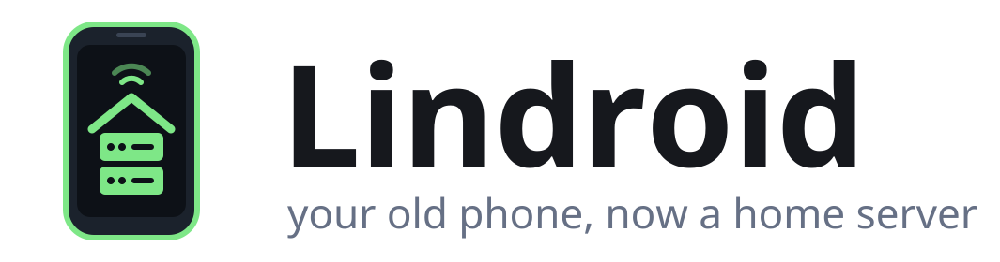

<p align="center">
  <picture>
    <source media="(prefers-color-scheme: dark)" srcset="docs/logo/lindroid-logo-dark.svg">
    
  </picture>
</p>

# Lindroid

**Turn an old Android phone into a home server.** No root, no Termux, one app.

Lindroid runs SSH, a web server, a Cloudflare tunnel and self-hosted apps (Jellyfin, Immich,
qBittorrent, Home Assistant) on any Android 10+ phone, and manages them from the phone or
from a web dashboard, where you can also deploy web apps straight from GitHub.

<p align="center">
  
  
</p>
<p align="center">
  
</p>

## Features

| Module | What you get | Port |
|--------|--------------|------|
| **SSH & SFTP** | Shell and file transfer, public-key login, `ssh -L` port forwarding | 8022 |
| **Web hosting** | Caddy serving `~/www`, plus sites deployed from GitHub | 8080 |
| **Cloudflare Tunnel** | Publish services on the internet: no port forwarding, works behind CGNAT | – |
| **Jellyfin** | Media server with **hardware transcoding on the phone's video encoder** | 8096 |
| **Immich** | Google Photos-style backup (face/object recognition off: too heavy for phones) | 2283 |
| **qBittorrent** | Downloads in order into the media library and keeps seeding; `torrent <magnet>` over SSH | 8081 |
| **Home Assistant** | Home automation (network and cloud integrations) | 8123 |
| **Dashboard** | Manage everything from a browser; deploy Node.js, Python and static sites from Git | 8800 |

- **Everything is a module.** Add, remove, turn on or off at any time, from the phone or the
  dashboard. Nothing you don't use runs.
- **Your storage, your choice.** Keep app data inside the app (no permissions), or put media
  and photos on internal storage, a microSD card or a USB drive, per app.
- **Built to stay up.** Foreground service, wakelocks, start on boot, automatic restarts
  with backoff, per-service logs. Crash loops show their reason in the UI.
- **Light.** A single APK under 40 MB per ABI; apps are downloaded only when you install them.

## Requirements

- Android 10 or newer; arm64 recommended (Immich images are 64-bit only, the rest also runs on
  32-bit ARM). Tested on emulated Android 10 and 16; pilot device: Galaxy S9+ (Exynos 9810).
- Free storage for the apps you pick: Jellyfin ≈ 420 MB (and wants 2 GB free), Immich ≈ 1.6 GB,
  Home Assistant ≈ 900 MB.

## Getting started

1. Build and install the APK (see [Building](#building)).
2. Open Lindroid, paste your SSH public key (`~/.ssh/id_ed25519.pub`), tap **Save & apply**,
   then **Start server**.
3. Tap **Allow running in background**. On Samsung phones also add Lindroid to
   *Settings → Battery → Background usage limits → Never sleeping apps*.
4. Android 12+: turn off the phantom process killer (the app shows how).
5. Open the dashboard at `http://<phone-ip>:8800` with the password shown in the app.
6. Keep the phone cool and, if you can, limit charging to about 80%.

```bash
ssh -p 8022 <phone-ip>                       # shell; `alpine` opens a root shell in Alpine Linux
sftp -P 8022 <phone-ip>                      # files; put your website in www/
ssh -p 8022 <phone-ip> torrent 'magnet:?…'   # download, in order, into Media/Downloads
ssh -p 8022 <phone-ip> torrent list          # progress
```

To publish a service on the internet, create a tunnel in the Cloudflare Zero Trust dashboard,
point a public hostname at `http://localhost:<port>`, and turn on the Cloudflare Tunnel module
with the tunnel token.

### Storage

App data stays inside the app by default. To use an SD card or USB drive, choose
**Change location** on the app (phone) and pick a volume:

- Android 11+: data goes to a visible `Lindroid/<name>` folder, with *All files access*.
- Android 10: apps can only write to their own folder on removable volumes
  (`Android/data/dev.lindroid/files/<name>`). Android deletes it if Lindroid is uninstalled;
  the picker says so.

Jellyfin and qBittorrent share one *Media* folder. Databases and settings always stay in
internal storage, because SD cards and USB drives are usually FAT/exFAT. If the card is removed,
apps wait for it instead of writing elsewhere. With storage access, every volume also appears
inside Alpine at `/storage/…`, so existing folders can be added to Jellyfin.

### Deploying from GitHub


Give a repository URL, branch and port. Node.js, Python and static sites are detected; build and
start commands and environment variables can be set. Apps get `$PORT`; static sites are served
by Caddy. **Redeploy** pulls and rebuilds, and a failed build keeps the old version running.
**Auto-deploy** checks the branch every 5 minutes, so no public webhook is needed. For private
repositories use `https://<token>@github.com/you/repo` with a read-only token; it is never shown
back in the dashboard.

## How it works

```
MainActivity / AppsActivity             Dashboard (:8800) ── single-page UI + JSON API
            │                                   │
ServerService ── foreground service, wakelocks, boot start, install and deploy jobs
            │
Supervisor ── one thread per process, own process group, restart with backoff, logs
            │
  sshd · caddy · cloudflared           proot ─┬─ Alpine Linux ── Jellyfin, qBittorrent, HA, deploys
  (Go, built for Android)                     └─ container images ── Immich server, Postgres
```

**Running Linux software without root.** Apps targeting Android 10+ may only execute files
from their native-library directory, and still map others with `mmap(PROT_EXEC)`. Lindroid
ships its daemons as `lib*.so` in the APK and runs everything else under
[proot](https://github.com/termux/proot), whose loader maps binaries from app storage. Alpine
Linux (3 MB, checksum-verified) is downloaded on first use and unpacked by a small extractor
([`Tar.kt`](app/src/main/java/dev/lindroid/Tar.kt)). Android 10's own `tar` can't cope with
the ownership changes apps aren't allowed to make.

**Container images without Docker.** [`Oci.kt`](app/src/main/java/dev/lindroid/Oci.kt) pulls
images from Docker Hub or ghcr.io. It picks the phone's architecture, verifies every layer's
digest, and applies whiteouts. Hard links become copies, since Android forbids them in app
storage, and absolute symlinks resolve inside the image. Immich runs from its official images
this way.

**Hardware transcoding.** The phone's video encoder is only reachable through Android's
MediaCodec (bionic `libmediandk` and binder), not VAAPI. Lindroid builds an Android-native
FFmpeg with MediaCodec. It presets Jellyfin's V4L2 option and points it at a shim that runs
that FFmpeg (`h264_v4l2m2m` → `h264_mediacodec`) and Jellyfin's own FFmpeg for everything
else. Android's `/system`, `/apex` and `/vendor` are bind-mounted into Alpine so the bionic
binary can run there.

### Patches

`native/patches/` holds the changes that make upstream code work in Android's app sandbox:

| Patch | Why |
|-------|-----|
| `proot-fork-to-clone` | Android rejects `fork`/`vfork` on x86_64 and armv7, and musl uses them; rewrite them as `clone(SIGCHLD)`. |
| `proot-sigsys-fork` | The same rewrite for syscalls the sandbox traps with SIGSYS, so proot's fast seccomp mode works everywhere (≈50× faster for syscall-heavy work). |
| `proot-sigsys-syscall-number` | On x86, proot's SIGSYS emulation read the syscall number from a register it had already overwritten, breaking `rename(2)` and with it `uv`. |
| `proot-sysvipc-memfd` | Apps targeting Android 10+ can't open `/dev/ashmem`; back emulated System V shared memory (PostgreSQL) with `memfd`. |
| `proot-netlink-reads` | Android lets apps read rtnetlink but not write it; proot took that as "netlink blocked" and faked empty replies, hiding every IPv4 address. |
| `proot-android-default-routes` | Android keeps default routes in per-network policy tables, so Linux software thought it was offline (libtorrent: no tracker announces, no DHT). Report them in the main table. |
| `proot-android-siocgifname` | Android denies `SIOCGIFNAME` to apps, breaking `if_indextoname(3)`; answer it from the tracer. |
| `ffmpeg-mediacodec-extradata-without-eos` | MP4/HLS headers were probed with a dummy frame plus end-of-stream; some encoders stay at EOS afterwards. |
| `ffmpeg-mediacodec-parameter-sets` | Codec2 encoders report SPS/PPS in the output format; capture them and repeat them before every key frame. |
| `ffmpeg-mediacodec-sync-frames` | Honour forced key frames (HLS segment boundaries) with `request-sync`, and start with a key frame after the probe. |

The supervisor starts every process in its own session and signals whole process groups:
proot ignores SIGTERM, and killing only proot would orphan the program it runs.

## Building

Needs JDK 17+, Go 1.23+ and the Android SDK with NDK r27+ (`ANDROID_NDK_HOME`).

```bash
native/build-all.sh                 # sshd, Caddy, cloudflared, proot, FFmpeg for arm64, armv7, x86_64
./gradlew assembleRelease           # APKs in app/build/outputs/apk/release/
adb install app/build/outputs/apk/release/app-arm64-v8a-release.apk
```

The individual scripts take ABIs as arguments (`native/build-ffmpeg.sh arm64-v8a`), and
versions can be overridden (`CADDY_VERSION=… CLOUDFLARED_VERSION=… native/build.sh`). Release
builds are signed with the debug key; use your own keystore to distribute them.

### Adding an app

Apps are data: add an entry to [`apps.json`](app/src/main/assets/apps.json). A simple app runs
an install script and a command in Alpine (see Jellyfin). A multi-service app pulls
container images and runs several processes, with `{{secret}}` passwords and `@data`/`@storage`
binds (see Immich). See [CONTRIBUTING.md](CONTRIBUTING.md).

## Security notes

- SSH accepts public keys only. The dashboard uses a generated password; sessions are
  HttpOnly/SameSite cookies, and scripts can send the password as a Bearer token.
- Everything listens on the phone's network, so keep the phone on a network you trust, and
  expose services to the internet through the Cloudflare tunnel rather than port forwarding.
- Other apps on the same phone can reach `localhost`. Lindroid binds databases to localhost and
  protects them with generated passwords. qBittorrent skips authentication for localhost so the
  `torrent` command works.

## Roadmap

- Root mode: chroot at native speed, ports below 1024, charge limiting
- More apps: Vaultwarden, Syncthing, Pi-hole/AdGuard; Tailscale
- Hostname routing for deployments through Caddy
- Verify hardware transcoding on more SoCs (Exynos, Snapdragon, MediaTek)

## License

Lindroid is free software under the [GNU General Public License v3.0](LICENSE). It bundles and
builds third-party components under their own licenses; see [THIRD_PARTY.md](THIRD_PARTY.md).
