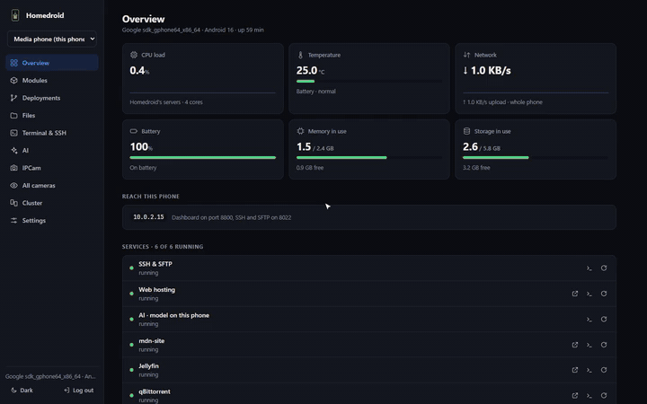
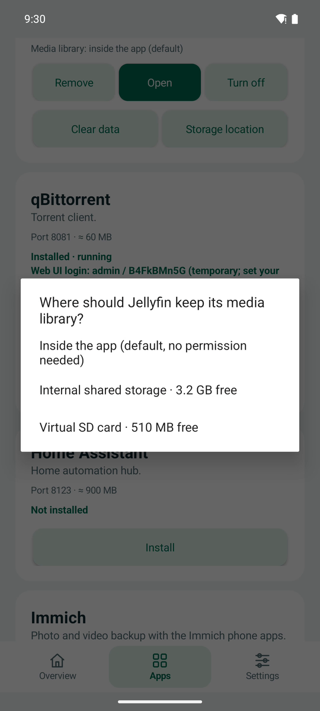
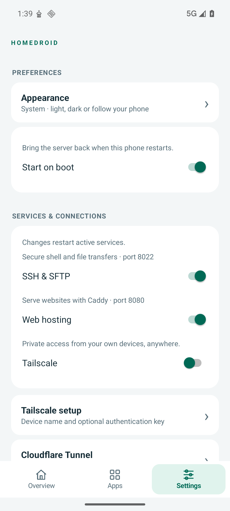
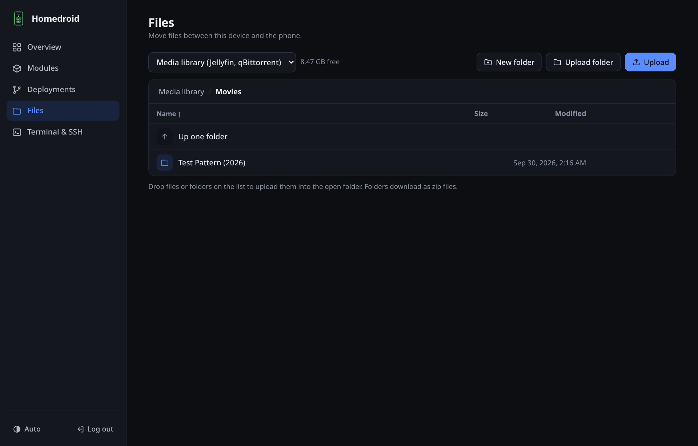
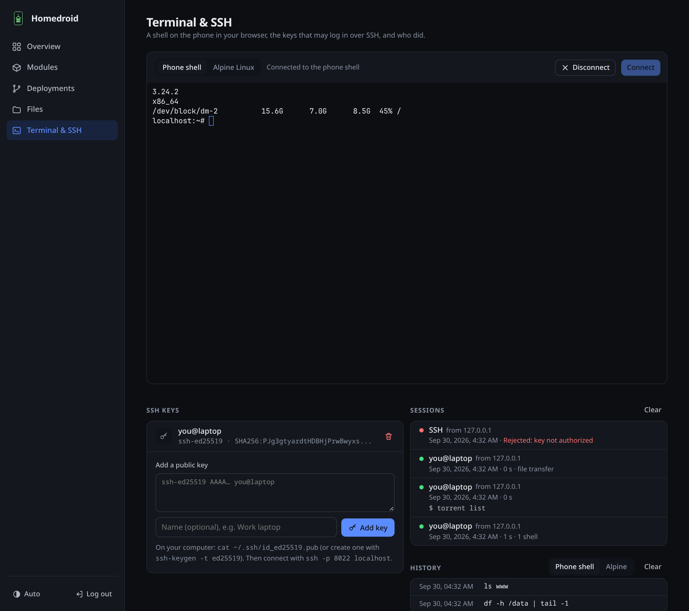
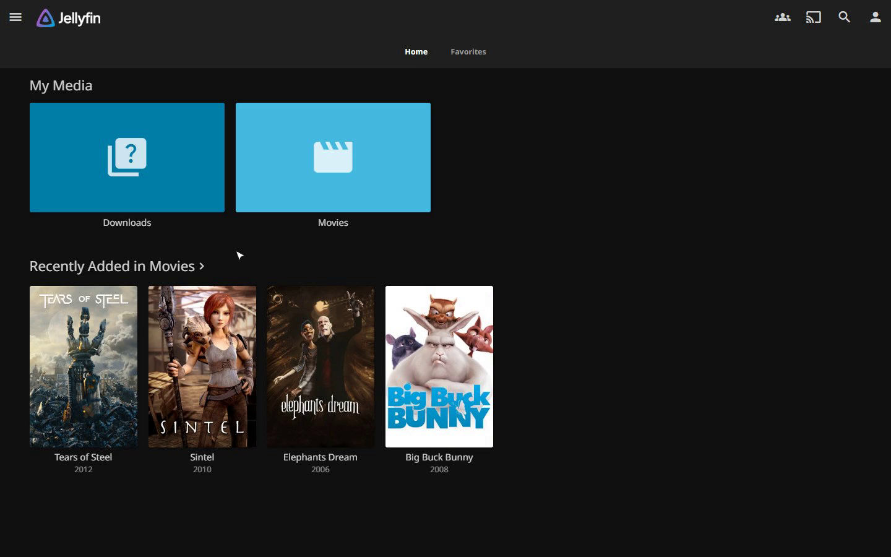
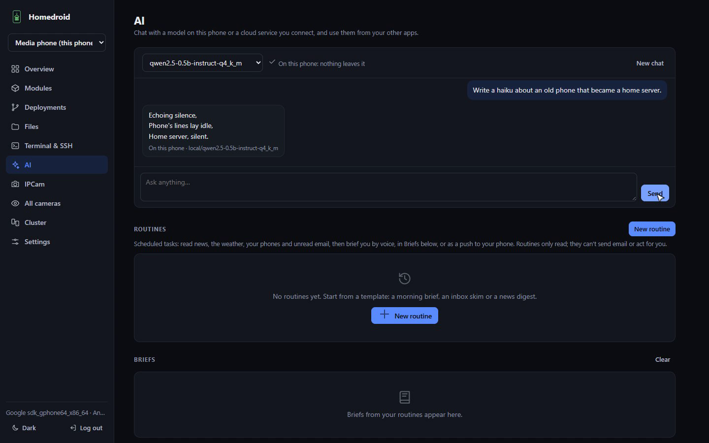
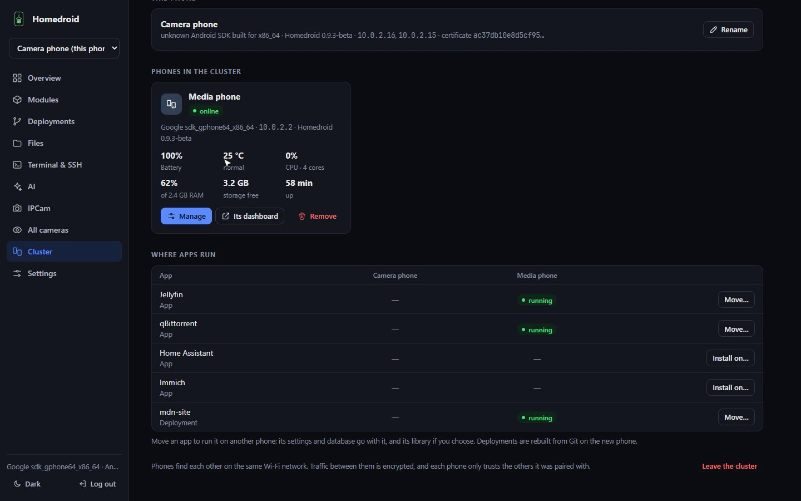

<p align="center">
  <picture>
    <source media="(prefers-color-scheme: dark)" srcset="docs/logo/homedroid-logo-dark.svg">
    
  </picture>
</p>

<h1 align="center">Homedroid: turn your old Android phone into a home server</h1>

<p align="center">
  <a href="https://github.com/sudiptacmd/homedroid/releases"></a>
  <a href="https://github.com/sudiptacmd/homedroid/actions/workflows/build.yml"></a>
  <a href="LICENSE"></a>
  
  
</p>

<p align="center">
  <b><a href="https://sudiptacmd.github.io/homedroid/">Website</a></b> ·
  <b><a href="https://github.com/sudiptacmd/homedroid/releases">Download the APK</a></b> ·
  <b><a href="#walkthrough">Watch the walkthrough</a></b> ·
  <b><a href="https://github.com/sudiptacmd/homedroid/issues/new/choose">Send feedback</a></b>
</p>

That phone in your drawer has an 8-core CPU, a hardware video encoder, gigabytes of RAM, Wi-Fi,
a battery that works as a built-in UPS, and it sips about as much power as an LED bulb.
**Homedroid turns it into a self-hosted home server**: a media server, a NAS for your USB drive
or microSD card, a photo backup, a torrent box, a web host, a network-wide ad blocker, a private AI and a smart-home hub,
all managed from a beautiful web dashboard. **No root, no Termux, no Linux skills needed:
one APK.**

- 🎬 **Jellyfin** streams your movies to every screen, transcoded by the **phone's own video
  encoder**.
- 💾 **A pocket NAS.** Plug in a USB drive or microSD card and reach it from any browser or over
  SFTP.
- 🧠 **AI on the phone.** llama.cpp runs models locally, with an OpenAI-compatible API for your
  other apps.
- 🌍 **Online in minutes.** Cloudflare Tunnel or Tailscale, so it works behind CGNAT with no
  port forwarding.
- 🛡️ **Ad blocking everywhere.** AdGuard Home filters ads and trackers for every device on your
  tailnet, at home or on mobile data.
- ⚡ **Wake on LAN from anywhere.** Turn on your desktop from the other side of the world.
- 🔎 **Network tools.** See who's on your network, scan ports, look up DNS and run speed tests.
- 🚀 **Deploy from GitHub.** Node.js, Python and static sites, rebuilt when you push.
- 📱 **Several phones, one dashboard.** Pair old phones into a cluster and move apps between them.

<p align="center">
  
</p>

## Walkthrough

<a href="https://github.com/sudiptacmd/homedroid/releases/download/v0.9.4-beta/homedroid-walkthrough.mp4"></a>

A 4½-minute tour: the phone app, the dashboard, files on an SD card, a Linux shell in
the browser, Jellyfin, AI on the phone, a deployment from GitHub and two phones working as
one. [Watch the full video (MP4, 13 MB)](https://github.com/sudiptacmd/homedroid/releases/download/v0.9.4-beta/homedroid-walkthrough.mp4)
or see the clips on the [website](https://sudiptacmd.github.io/homedroid/).

<p align="center">
  
  
  
  
</p>

## Download

Homedroid is in **beta (0.9.4)** and free. Get the APK from the
[latest release](https://github.com/sudiptacmd/homedroid/releases):

| Your phone | APK |
|------------|-----|
| Almost every phone from the last ~8 years (64-bit) | `homedroid-<version>-arm64-v8a.apk` |
| Older 32-bit phones | `homedroid-<version>-armeabi-v7a.apk` |
| Emulators, Chromebooks | `homedroid-<version>-x86_64.apk` |
| Not sure | `homedroid-<version>-universal.apk` (larger, runs everywhere) |

Open it on the phone and allow installing from your browser or file manager, or run
`adb install homedroid-<version>-arm64-v8a.apk`. `SHA256SUMS` in each release lets you check
the download. Every release is signed with the same key, so newer versions install over older
ones and keep your data.

**Updating:** in the dashboard open **Settings → App updates → Download and install**. The phone
fetches the right APK itself and Android asks you to confirm (on Android 12 and later, updates
after the first install without a prompt). The server comes back on the new version by itself.

## What you get

| Module | What it does | Port |
|--------|--------------|------|
| **Dashboard** | Manage everything from any browser: live load, files, a terminal, apps, logs, updates | 8800 |
| **SSH & SFTP** | A real shell and file transfer, public-key login, `ssh -L` port forwarding | 8022 |
| **Web hosting** | Caddy serving `~/www`, plus sites deployed from GitHub | 8080 |
| **Cloudflare Tunnel** | Publish services on the internet without port forwarding; works behind CGNAT | – |
| **Tailscale** | Reach every module privately from your own devices, anywhere; optional HTTPS, exit node and subnet routes. No root, no VPN slot | – |
| **Jellyfin** | Media server with **hardware transcoding on the phone's video encoder** | 8096 |
| **Immich** | Google Photos-style backup of your photos and videos | 2283 |
| **qBittorrent** | Torrents download in order into the media library and show up in Jellyfin; `torrent <magnet>` over SSH | 8081 |
| **Home Assistant** | Home automation (network and cloud integrations) | 8123 |
| **IPCam** | Live view from any camera, photos, video, motion recording, the microphone, and spoken announcements | 8800 |
| **AI** | Chat and an OpenAI-compatible API, with models **on the phone** (llama.cpp, GPU or CPU) or cloud services; scheduled **routines** that brief you by voice or push | 8090 |
| **AdGuard Home** | Network-wide ad and tracker blocking, with blocklists, statistics and a query log; tailnet devices can use the phone as their DNS server | 3000 (DNS 1053) |
| **Network tools** | This phone's network, device discovery, ping, traceroute, DNS lookups, port scans, HTTP checks, LAN and internet speed tests | 8800 |
| **Wake on LAN** | Wake computers at home from anywhere the dashboard reaches; also from scripts and phone shortcuts | 8800 |
| **Cluster** | Several phones, one dashboard: pick which phone runs each app, move apps with their data, every camera on one page | 8801 |

- **Everything is a module.** Add, remove, turn on or off at any time. Nothing you don't use runs.
- **Your storage, your choice.** Keep app data inside the app (no permissions needed) or put
  media and photos on internal storage, a **microSD card or a USB drive**, per app.
- **Built to stay up.** A foreground service, wakelocks, start on boot, automatic restarts with
  backoff, and per-service logs. Crash loops show their reason right in the UI.
- **Light.** One APK under 50 MB per ABI; apps are downloaded only when you install them.

## Getting started

1. Install the APK from [Download](#download) (or [build it](#building)) and open Homedroid.
2. Tap **Start server**. The overview shows the dashboard address, like `http://192.168.1.20:8800`,
   and **Dashboard login** shows its password.
3. Let it run in the background: **Settings → Battery settings → allow**. On Samsung also add
   Homedroid to *Battery → Background usage limits → Never sleeping apps*. On Android 12+ turn
   off the phantom process killer (the app shows you how).
4. Open the dashboard from your computer, or tap **Open control panel** on the phone.
5. For SSH, paste your public key (`~/.ssh/id_ed25519.pub`) under **Settings → SSH public keys**.
6. Keep the phone cool and, if your phone supports it, limit charging to about 80%.

```bash
ssh -p 8022 <phone-ip>                       # a shell; `alpine` opens a root shell in Alpine Linux
sftp -P 8022 <phone-ip>                      # files; put your website in www/
ssh -p 8022 <phone-ip> torrent 'magnet:?…'   # download, in order, into Media/Downloads
ssh -p 8022 <phone-ip> torrent list          # progress
```

**Reach it from anywhere.** Turn on the **Tailscale** module and log in with the link it shows:
every module is then at `http://homedroid:<port>` on your tailnet. Or publish a service on the
internet with a **Cloudflare Tunnel**: create a tunnel in Cloudflare Zero Trust, point a public
hostname at `http://localhost:<port>` and paste the tunnel token. Both modules have a
step-by-step **Setup guide** in the dashboard.

## Tour

### The dashboard

Open `http://<phone-ip>:8800` on a computer or a phone. It works without internet access:
everything it needs is inside the app.

<p align="center">
  
  
</p>

- **Overview:** CPU load, temperature, network speed, battery, memory and storage, and every
  service with its logs and a restart button.
- **Modules:** install, remove and turn modules on or off; set up Cloudflare Tunnel and
  Tailscale with built-in guides. **Clear data** resets an app like a fresh install.
- **Files:** the media and photo libraries, the SSH home with your website, phone storage, and
  **SD cards and USB drives**. Upload files or whole folders (drag and drop works), download
  files or folders as zip, play videos and music and open pictures and PDFs in the browser,
  rename, move and delete.
- **Terminal & SSH:** a terminal in the browser, in the phone's shell or straight into Alpine
  Linux; the SSH keys that may log in; a log of every SSH and terminal session (who, from where,
  what they ran, and rejected logins).
- **Deployments**, **AI**, **IPCam** and **Cluster**, below.

### A NAS in your pocket: USB drives and SD cards

Plug a USB drive into the phone (with an OTG adapter) or insert a microSD card, and it shows up
in **Files** next to the phone's own storage. Stream a video straight from it, drop a folder of
photos onto it, or download a whole folder as a zip. Over SFTP the drive is at
`/storage/<volume-id>`, so `sshfs`, rclone, WinSCP, Cyberduck or your file manager's
`sftp://` support can mount it like a network drive.

Apps can live there too: choose **Storage location** on an app and pick the card. On Android
11+ the data goes to a visible `Homedroid/<name>` folder (this needs *All files access*, which
the app asks for). Databases and settings always stay in internal storage, because cards and
drives are usually FAT32 or exFAT. If the card is removed, apps wait for it instead of writing
somewhere else, and the location simply disappears from Files until it's back. With storage
access every volume also appears inside Alpine at `/storage/…`, so existing folders can be added
to Jellyfin.

> Good to know: FAT32 can't hold files over 4 GB (use exFAT for movies), and on Android 10 apps
> can only write to their own folder on removable storage, which Android deletes if Homedroid
> is uninstalled. The storage picker tells you when that applies.

### Media: Jellyfin and qBittorrent



Jellyfin and qBittorrent share one *Media* folder. Installing both adds a *Downloads* library
to Jellyfin that picks up finished torrents within a minute, and torrents download in order so
you can start watching before they finish. Jellyfin transcodes with the phone's video encoder,
so the CPU stays cool (see [how](#hardware-transcoding-on-a-phone)).

### Deploying from GitHub


Give a repository URL, branch and port. Node.js, Python and static sites are detected; build
and start commands and environment variables can be set. Apps get `$PORT`; static sites are
served by Caddy. **Redeploy** pulls and rebuilds, and a failed build keeps the old version
running. **Auto-deploy** checks the branch every 5 minutes, so no public webhook is needed. For
private repositories use `https://<token>@github.com/you/repo` with a read-only token; it is
never shown back in the dashboard.

### AI on your phone



Turn on **AI** in Modules, then open the AI page:

- **On this phone:** install llama.cpp (built for Android by this project, about 17 MB) and
  download a model (Gemma 4 E2B, Qwen2.5, Llama 3.2 or Gemma 3), paste any Hugging Face `.gguf` link, or
  upload one. The page **recommends** the best model your phone runs well, from its memory, free
  space and measured speed. Nothing leaves the phone.
- **GPU or CPU:** the **Benchmark** measures both and *Auto* uses the faster: Vulkan on most
  phone GPUs, OpenCL on Qualcomm Adreno. A GPU whose driver crashes llama.cpp is detected and
  never used.
- **Cloud services:** connect OpenAI, Google Gemini or any OpenAI-compatible API (OpenRouter,
  Groq, Ollama or LM Studio on your computer). Keys stay on the phone, and a cloud model can
  stand in when the phone is too hot.
- **For your other apps:** `http://<phone-ip>:8090/v1` is an OpenAI-compatible API with its own
  key. Use `local/<model>` or `<service>/<model>` as the model name.
- **Routines** run on a schedule: they read news feeds, web pages, the weather, your phones'
  health and unread email (IMAP with an app password; nothing is marked read), and write a brief
  that is read aloud on any phone, kept under *Briefs*, or pushed with ntfy or Telegram.

Expect a few to a dozen words a second with small (0.5–3B) models. llama.cpp needs a 64-bit
phone.

### IPCam

Turn on **IPCam**, then tap **Enable camera access** in the phone app once. From the dashboard
you can watch a live view from any camera, take photos, record video, toggle the torch, listen
to or record the microphone, and **Announce** a typed message with the phone's voice.

- **Continuous monitoring** keeps one camera ready with the browser closed and saves a clip only
  when something moves. Each camera has its own resolution (240p–1080p), frame rate, rotation,
  motion threshold, quiet period and clip length.
- **Capture storage** has a shared limit (128 MB–100 GB); the oldest captures make room
  automatically and active recordings are never touched.
- Android requires camera and microphone services to start while the app is visible, so after a
  reboot tap **Enable camera access** again. Android's privacy indicators stay on while IPCam is
  active, and its notification has a **Stop** button.

### Ad blocking with AdGuard Home

Install **AdGuard Home** from Modules and it filters ads and trackers out of DNS lookups for
every device you point at it, with blocklists, statistics and a query log in its web UI (port
3000; the login is on the app card).

Android won't let an app use port 53, the port every device asks for DNS on, so AdGuard Home
listens on **1053**. The easiest way round that is Tailscale: Homedroid's Tailscale passes port
53 on the phone's tailnet address to 1053, so in the Tailscale admin console you add the phone
as a custom nameserver, turn on **Override DNS servers**, and every device on your tailnet is
filtered, at home or on mobile data. Routers that can forward DNS to a port (OpenWrt, pfSense,
anything with dnsmasq) can send the whole home network there too. The **Setup guide** on the
card walks through both.

### Network tools

Turn on **Network tools** and a **Network** page shows this phone's addresses, gateway, DNS
servers and live throughput, and finds the devices around it (mDNS, SSDP/UPnP and quick TCP
probes of the local network). Its tools run on the phone and stream their output to the page:
ping, traceroute, DNS lookups (handy for testing AdGuard Home), port scans with nmap, HTTP
checks with timings and certificate expiry, whois, LAN speed tests with iperf3 (the phone can be
the server too) and an internet speed test. Live packet capture needs root, so there's no
Wireshark capture; everything else works as an app.

### Wake on LAN

Turn on **Wake on LAN**, add your computers with their MAC addresses, and wake them with one
click from anywhere the dashboard reaches: over Tailscale, through a Cloudflare tunnel, or from
another phone in your cluster. Homedroid sends the magic packet on every network the phone is
on, and shows whether a computer is on when you give it an address. Scripts and phone shortcuts
can call `POST /api/wol/wake` with the dashboard password as a Bearer token.

### Cluster: several phones, one dashboard



Got more than one old phone? Open **Cluster → Add a phone**: phones on the same network show up
by themselves (or enter an address, for example over Tailscale). Both phones show the same
6-digit code; approve it on the phone being added.

- **One dashboard.** Pick a phone at the top of the sidebar and every page shows that phone.
- **Where apps run.** See every app and deployment on every phone. **Move** an app and its
  settings, database and (if you like) library go with it; deployments are rebuilt from Git.
- **All cameras** on one page, and **Copy/Move to another phone** for files and folders.

Phones talk over mutual TLS on port 8801 and trust only phones they were paired with. A phone
in the cluster can fully control the others, so give each one a strong dashboard password.

### Home-screen widget

Add **Homedroid status** from your launcher's widgets: every phone in the cluster (online,
battery, temperature) and the services running on this one, refreshed every minute.

## How it works: the clever bits

Android was never meant to run servers, and apps don't get root. Here's how Homedroid gets a
full Linux server stack running inside an ordinary app, without asking you to root anything.

<p align="center">
  
</p>

### Linux programs inside an Android app

Since Android 10, apps may only run programs that shipped inside their APK, from the folder
where Android unpacks native libraries. So Homedroid's own servers (SSH, Caddy, cloudflared,
Tailscale, FFmpeg) are compiled for Android and packed into the APK **disguised as libraries**
(`libsshd.so`, `libcaddy.so` and so on). Android unpacks them, and Homedroid runs them from there.

Everything else runs in **Alpine Linux** under [proot](https://github.com/termux/proot). proot
intercepts a program's system calls and translates them, so software that expects a normal Linux
machine (paths like `/usr/bin`, a root user, `/proc`) believes it has one, while really it is
living inside the app's private folder. Alpine (3 MB, checksum-verified) is downloaded on first
use and unpacked by Homedroid's own small extractor, because Android 10's `tar` gives up on
ownership changes apps aren't allowed to make.

### Docker images, without Docker

Docker needs kernel features no Android app can use. But a container image is really just a
stack of tarballs plus a recipe. [`Oci.kt`](app/src/main/java/dev/homedroid/Oci.kt) talks to
Docker Hub and ghcr.io directly: it picks your phone's architecture, downloads each layer,
verifies its checksum, and stacks them the way Docker would, including deleted-file markers.
Android forbids hard links in app storage, so those become copies, and absolute symlinks are
rewritten to stay inside the image. The result runs under proot like any other Alpine program.
That's how **Immich runs from its official images** on a phone, PostgreSQL and all.

### Hardware transcoding on a phone

Every phone has a dedicated video encoder that can squeeze 1080p video in real time while
barely warming up. On a PC, Jellyfin reaches such hardware through Linux interfaces (VAAPI,
V4L2). On Android the encoder is only reachable through **MediaCodec**, which lives in
Android's own libraries and talks to system services, so a normal Linux FFmpeg can't use it.

So Homedroid builds a **separate FFmpeg for Android** with MediaCodec support and plays a small
trick on Jellyfin: it turns on Jellyfin's V4L2 hardware option and points Jellyfin at a tiny shim.
When Jellyfin asks for `h264_v4l2m2m`, the shim quietly runs the Android FFmpeg with
`h264_mediacodec` instead; everything else goes to Jellyfin's own FFmpeg. To let that Android
binary run inside Alpine, Android's `/system`, `/apex` and `/vendor` are mounted into the
Alpine world. Jellyfin never knows it's on a phone.

### Patches that make it all fit

Some upstream code needed help with Android's sandbox. `native/patches/` keeps the changes,
each one small and explained:

| Patch | Why |
|-------|-----|
| `proot-fork-to-clone` | Android rejects `fork`/`vfork` on x86_64 and armv7, and musl uses them; rewrite them as `clone(SIGCHLD)`. |
| `proot-sigsys-fork` | The same rewrite for syscalls the sandbox traps with SIGSYS, so proot's fast seccomp mode works everywhere (≈50× faster for syscall-heavy work). |
| `proot-sigsys-syscall-number` | On x86, proot's SIGSYS emulation read the syscall number from a register it had already overwritten, breaking `rename(2)` and with it `uv`. |
| `proot-sysvipc-memfd` | Apps targeting Android 10+ can't open `/dev/ashmem`; back emulated System V shared memory (PostgreSQL) with `memfd`. |
| `proot-netlink-reads` | Android lets apps read rtnetlink but not write it; proot took that as "netlink blocked" and faked empty replies, hiding every IPv4 address. |
| `proot-android-default-routes` | Android keeps default routes in per-network policy tables, so Linux software thought it was offline (libtorrent: no tracker announces, no DHT). Report them in the main table. |
| `proot-android-siocgifname` | Android denies `SIOCGIFNAME` to apps, breaking `if_indextoname(3)`; answer it from the tracer. |
| `ffmpeg-mediacodec-extradata-without-eos` | MP4/HLS headers were probed with a dummy frame plus end-of-stream; some encoders stay at EOS afterwards. |
| `ffmpeg-mediacodec-parameter-sets` | Codec2 encoders report SPS/PPS in the output format; capture them and repeat them before every key frame. |
| `ffmpeg-mediacodec-sync-frames` | Honour forced key frames (HLS segment boundaries) with `request-sync`, and start with a key frame after the probe. |

The supervisor starts every process in its own session and signals whole process groups: proot
ignores SIGTERM, and killing only proot would orphan the program it runs.

## Requirements

- Android 10 or newer; a 64-bit phone is recommended (Immich and on-phone AI need one, the rest
  also runs on 32-bit ARM). Runs daily on a Galaxy S9+ (Exynos 9810) and is tested on emulated
  Android 10 and 16.
- Free storage for the apps you pick: Jellyfin ≈ 420 MB (and wants 2 GB free), Immich ≈ 1.6 GB,
  Home Assistant ≈ 900 MB.

## Measurements

Measured with [`tools/bench.py`](tools/bench.py), which drives a phone over adb and SSH. **Run it
on your phone and [share the output](https://github.com/sudiptacmd/homedroid/issues/new/choose)**
to add your phone to this table.

| | Emulator (Android 10, x86_64, 3 GB RAM) |
|---|---|
| **Idle RAM**, SSH + web only | 136 MB (3 processes) |
| **Idle RAM**, + Jellyfin, qBittorrent, Immich | 1.19 GB (34 processes; Immich ≈ 800 MB) |
| **Idle CPU**, SSH + web only | 0.1 % of one core |
| **Idle CPU**, + Jellyfin, qBittorrent, Immich | 2.6 % of one core |
| **Network**, phone → computer | 457 MB/s HTTP, 194 MB/s SSH (virtual NIC) |
| **Transcoding**, 1080p → 720p H.264 | 114 fps (3.8× real time) through MediaCodec¹ |

¹ The emulator's MediaCodec encoder is software running on the host. On a phone MediaCodec uses
the dedicated video hardware, which is the point: it keeps the CPU free and cool.

## Good to know

Homedroid does a lot inside an ordinary app, and a few things follow from that:

- **No root, so** no ports below 1024 (use 8080 or the Cloudflare tunnel), and proot adds some
  overhead to syscall-heavy work such as package installs, Home Assistant's startup and
  databases. Programs run at full speed once they are computing.
- **Battery managers.** Vendor battery savers (Samsung, Xiaomi, …) and Android 12+'s phantom
  process killer need the one-time settings in [Getting started](#getting-started).
- **No raw hardware access for apps.** Home Assistant can't use USB radios (Zigbee, Z-Wave) or
  Bluetooth, and nothing can use serial ports or GPIO.
- **Transcoding is encode-side.** Decoding, scaling, subtitle burn-in and HDR tone mapping run
  in software; H.264 and HEVC encoding use the phone's encoder.
- **Immich** runs with machine learning (faces, smart search) turned off: it's too heavy for a
  phone.
- **CPU figures.** Android doesn't let apps read system-wide CPU load or most temperature
  sensors, so the dashboard shows Homedroid's own load (which is all the servers), the battery
  temperature and Android's thermal status, plus the CPU temperature on phones that expose it.
- **No port 53, no packet capture.** Without root an app can't listen on ports below 1024 or
  sniff traffic, so AdGuard Home answers on 1053 (Tailscale and capable routers bridge that) and
  the network tools work with ordinary connections.
- **Plain HTTP on your LAN.** The dashboard and apps speak HTTP on your home network (traffic
  between cluster phones is encrypted). From outside, use Tailscale, the Cloudflare tunnel or
  `ssh -L`.
- **App updates.** Apps come from Alpine and container registries at install time; update them
  with `apk upgrade` over SSH or by reinstalling from the Apps screen.

## Security

- SSH accepts public keys only. The dashboard uses a generated password; sessions are
  HttpOnly/SameSite cookies, and scripts can send the password as a Bearer token. The dashboard
  password also opens the web terminal, so treat it like an SSH key. SSH and terminal sessions,
  including rejected logins, are logged in the dashboard.
- Five failed password checks from one address trigger a 15-minute cooldown, with a shared
  budget across addresses. Sessions expire after 24 hours. See the
  [0.8.5 security review](docs/SECURITY-REVIEW-0.8.5.md).
- Cluster phones pair with a code checked on both phones, talk over mutual TLS, and can fully
  control each other, so the weakest dashboard password protects the whole cluster. The AI API
  has its own key; cloud keys and the email password never leave the phone. See the
  [0.9.0 security review](docs/SECURITY-REVIEW-0.9.0.md).
- Files from your libraries are served so they can't run script on the dashboard's address.
- Everything listens on the phone's network, so keep the phone on a network you trust and expose
  services through the Cloudflare tunnel rather than port forwarding.
- Other apps on the same phone can reach `localhost`. Homedroid binds databases to localhost and
  protects them with generated passwords. qBittorrent skips authentication for localhost so the
  `torrent` command works.

## Building

Needs JDK 17+, Go 1.23+ and the Android SDK with NDK r27+ (`ANDROID_NDK_HOME`).

```bash
native/build-all.sh                 # sshd, Caddy, cloudflared, proot, FFmpeg for arm64, armv7, x86_64
./gradlew assembleRelease           # APKs in app/build/outputs/apk/release/
adb install app/build/outputs/apk/release/app-arm64-v8a-release.apk
```

The individual scripts take ABIs as arguments (`native/build-ffmpeg.sh arm64-v8a`), and
versions can be overridden (`CADDY_VERSION=… CLOUDFLARED_VERSION=… native/build.sh`). To sign
release builds with your own key, copy `keystore.properties.example` to `keystore.properties`;
without it they use the debug key. Releases are built by CI: pushing a tag such as
`v0.9.4-beta` builds every ABI, signs the APKs and publishes them with `SHA256SUMS`.

### Adding an app

Apps are data: add an entry to [`apps.json`](app/src/main/assets/apps.json). A simple app runs
an install script and a command in Alpine (see Jellyfin). A multi-service app pulls container
images and runs several processes, with `{{secret}}` passwords and `@data`/`@storage` binds (see
Immich). See [CONTRIBUTING.md](CONTRIBUTING.md).

## Contributing and feedback

Homedroid is built in the open, and the most useful thing you can do is **try it on your phone
and tell us how it went**:

- 🐛 [Report a bug](https://github.com/sudiptacmd/homedroid/issues/new?template=bug_report.yml):
  phone model, Android version and the service's log help most.
- 📱 [Share your phone](https://github.com/sudiptacmd/homedroid/issues/new?template=phone_report.yml):
  "works on my Pixel 4a" and `tools/bench.py` numbers fill the measurements table.
- 💡 [Suggest an app or a feature](https://github.com/sudiptacmd/homedroid/issues/new?template=feature_request.yml).
- 🛠️ Pull requests are welcome: new apps in `apps.json`, fixes, translations, docs. Start with
  [CONTRIBUTING.md](CONTRIBUTING.md).
- ⭐ If Homedroid gave an old phone a second life, a star helps others find it.

## Roadmap

- Cluster failover: restart an app on another phone when its phone goes away
- Root mode: chroot at native speed, ports below 1024, charge limiting
- More apps: Vaultwarden, Syncthing
- Capture this phone's own traffic for Wireshark (through Android's VPN service)
- Hostname routing for deployments through Caddy
- Verify hardware transcoding on more chips (Exynos, Snapdragon, MediaTek)

## License

Homedroid is free software under the [GNU General Public License v3.0](LICENSE). It bundles and
builds third-party components under their own licenses; see [THIRD_PARTY.md](THIRD_PARTY.md).
The walkthrough uses Blender Foundation open movies (*Sintel*, *Big Buck Bunny*, *Elephants
Dream*, *Tears of Steel*), © Blender Foundation, [CC BY](https://creativecommons.org/licenses/by/3.0/).
